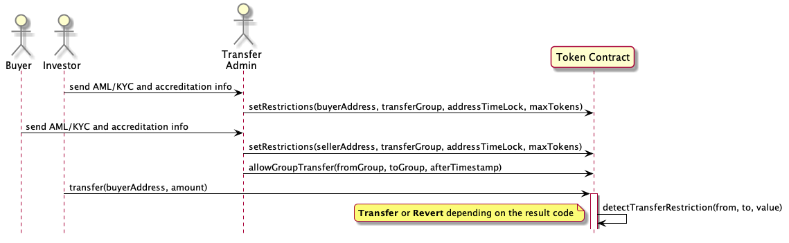
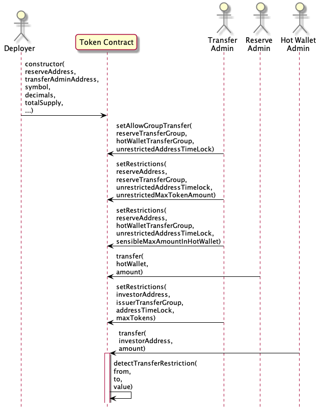
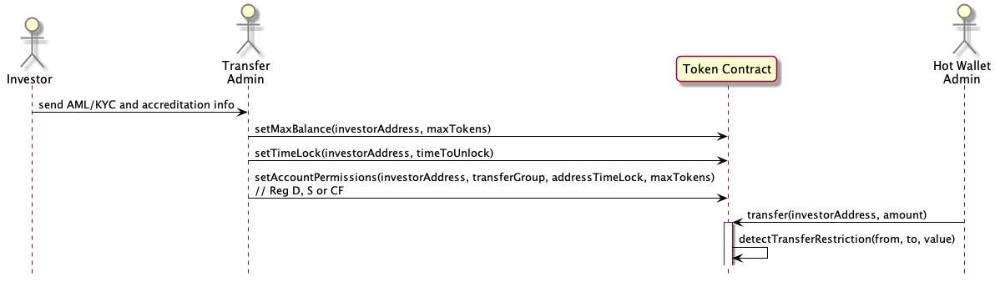

# CoMakery Security Token

## An Open Source Security Token From Your Friends At CoMakery

## Status: Work In Progress

## Overview

This is an open source Security Token from CoMakery. The core purpose of the token is to enforce transfer restrictions for certain groups.

It implements the **ERC-20** token standard and the **ERC-1404** security token standard. It attempts to balance simplicity and sufficiency for smart contract tokens that need to comply with regulatory authorities. 

Simplicity is necessary to make the full operations of the contract clear to users of the smart contracts. Simplicity also reduces the number of smart contract lines that need to be secured (each line of a smart contract is a security liability).

## Disclaimer

This open source software is provided with no warranty. This is not legal advice. CoMakery is not a legal firm and is not your lawyer. Securities are highly regulated across multiple jurisdictions. Issuing a security token incorrectly can result in financial penalties and jail time if you do it wrong. Consult a lawyer and tax advisor. Conduct an independent security audit of the code.

# Transfer Restrictions

Here's an overview of how transfer restrictions are configured and enforced.

The Transfer Admin for the Token Contract can provision account addresses to transfer and receive tokens under certain conditions. This is the process for configuring transfer restrictions and transferring tokens:
1. An Investor sends their Anti Money Laundering and Know Your Customer (AML/KYC) information to the Transfer Admin or to a proxy vetting service to verify this information. The benefit of using a qualified third party provider is to avoid needing to store privately identifiable information. This code does not provide a solution for collecting AML/KYC information.
2. The Transfer Admin calls `setAccountPermissions(investorAddress, transferGroup, addressTimeLock, maxTokens)` to provision their account. Initially this will be done for the Primary Issuance of tokens to investors where tokens are distributed directly from the issuer to holder accounts.
3. A potential buyer sends their AML/KYC information to the Transfer Admin or a trusted AML/KYC provider.
4. The Transfer Admin calls `setAccountPermissions(buyerAddress, transferGroup, addressTimeLock, maxTokens)` to provision the Buyer account.
5. At this time or before, the Transfer Admin authorizes the transfer of tokens between account groups with `setAllowGroupTransfer(fromGroup, toGroup, afterTimestamp)` . Note that allowing a transfer from group A to group B by default does not allow the reverse transfer from group B to group A. This would have to be done separately. An example is that Reg CF unaccredited investors may be allowed to sell to Accredited US investors but not vice versa.

## Overview of Transfer Restriction Enforcement Functions

| From | To | Restrict | Enforced By | Admin Role |
|:-|:-|:-|:-|:-|
| Reg D/S/CF | Anyone | Until TimeLock ends | `setTimeLock(investorAddress)` | Transfer Admin |
| Reg S Group | US Accredited | Forbidden During Flowback Restriction Period | `setAllowGroupTransfer(fromGroupS, toGroupD, afterTime)` | Transfer Admin |
| Reg S Group | Reg S Group | Forbidden Until Shorter Reg S TimeLock Ended | `setAllowGroupTransfer(fromGroupS, toGroupS, afterTime)` | Transfer Admin |
| Issuer | Reg CF with > maximum value of tokens allowed | Forbid transfers increasing token balances above max balance | `setMaxBalance(amount)` | Transfer Admin |
| Stolen Tokens | Anyone | Fix With Freeze, Burn, Reissue| `freeze(stolenTokenAddress);`  `burnFrom(address, amount);` `mint(newOwnerAddress);` | Transfer Admin can `freeze()` and Super Admin can do `mint()` `burnFrom()` and `freeze()` |
| Any Address During Regulatory Freeze| Anyone | Forbid all transfers while paused | `pause()` | Super Admin |

# Roles

The smart contract enforces specific admin roles. The roles divide responsibilities to reduce abuse scenarios. Ideally each role should be managed by a separate admin with separate key control. In some cases, such as the Super Admin and Token Treasury Wallet Manager, it is recommended that the role's private key is managed through multi signature (e.g. requiring 2 of 3 or 4 of 6 approvers).

The roles fall into two categories Admin Roles and Wallet Account Address Managers. Wallet account addresses are configured using the same transfer restriction rules as individual account address restrictions.

## Admin Roles

| Function | Super Admin | Transfer Admin |
|-|-|-|
| pause() | **yes** | no |
| unpause() | **yes** | no |
| grantSuperAdmin() | **yes** | no |
| removeSuperAdmin() | **yes** | no |
| grantTransferAdmin() | **yes** | no |
| removeTransferAdmin() | **yes** | no |
| mint() | **yes** | no |
| burnFrom() | **yes** | no |
| freeze() | **yes** | **yes** |
| setMaxBalance() | no | **yes** |
| setTimeLock() | no | **yes** |
| removeTimeLock() | no | **yes** |
| setGroup() | no | **yes** |
| setAccountPermissions() | no | **yes** |
| setAllowGroupTransfer() | no | **yes** |
| setTransferRules() | no | **yes** |

## Wallet Account Address Managers

When the token smart contract is deployed the contract is configured with a treasury reserve admin that receives all of the initial tokens for the smart contract. The wallet account address holding all of the initially issued tokens should not have any admin roles associated with them.

The transfer admin role may have some tokens in it for hot wallet administration. It is probably safer for the transfer admin and hot wallets to be separate human administrators - especially if multi-signature wallets are not used for the Hot Wallet or Transfer Admin roles.

## Individual Account Permissions

Individual token holders have accounts that are provisioned by the transfer admin as described below...

# Use Cases

## Initial Security Token Deployment

1. The Deployer configures the parameters and deploys the smart contracts to a public blockchain. At the time of deployment, the deployer configures a separate token reserve address and Transfer Administrator address. This allows the reserve security tokens to be stored in cold storage since the treasury reserve address private keys are not needed for everyday use by the Transfer Admin.
2. The Transfer Admin then provisions a hot wallet address for distributing tokens to investors or other stakeholders. The Transfer Admin uses `setAccountPermissions(investorAddress, transferGroup, addressTimeLock, maxTokens)` to set address restrictions.
3. The Transfer Admin authorizes the transfer of tokens between account groups with `setAllowGroupTransfer(fromGroup, toGroup, afterTimestamp)` .
4. The Reserve Admin then transfers tokens to the Hot Wallet address.
5. The Hot Wallet Admin then transfers tokens to investors or other stakeholders who are entitled to tokens.

## Setup For Separate Issuer Private Key Management Roles

By default the reserve tokens cannot be transferred to. To allow transfers the Transfer Admin must configure transfer rules using both `setAccountPermissions(account, ...)` to configure the individual account rules and `setAllowGroupTransfer(...)` to configure transfers between accounts in a group. A group represents a category like US accredited investors (Reg D) or foreign investors (Reg S).

During the setup process to split transfer oversight across three private key holders, the Transfer Admin can setup rules that only allow the Reserve Admin to **only** transfer tokens to the Hot Wallet admin address. The Hot Wallet should be restricted to a limited maximum balance necessary for doing one batch of token distributions - rather than the whole reserve. The use of a hot wallet for small balances also makes everyday token administration easier without exposing the issuer's reserve of tokens to the risk of total theft in a single transaction. Each of these private keys may also be managed with a multi-sig solution for added security. Multi-sig is especially important for the token reserve admin.

Here is how these restricted admin accounts can be configured:
1. Transfer Admin, Reserve Admin and Hot Wallet admin accounts are managed by separate users with separate keys. For example, separate Nano Ledger S hardware wallets.
2. Reserve and Hot Wallet addresses have their own separate transfer groups
    * `unrestrictedAddressTimeLock = 0` this timestamp will always have passed
    * `unrestrictedMaxTokenAmount = 2**256 -1` is the largest number storable this number is available as the `MAX_UNIT()` constant.
    * `setAccountPermissions(reserveAddress, reserveTransferGroup, unrestrictedAddressTimelock, unrestrictedMaxTokenAmount)`
    * `setAccountPermissions(reserveAddress, hotWalletTransferGroup, unrestrictedAddressTimeLock, sensibleMaxAmountInHotWallet)`
3. Reserve Address can only transfer to Hot Wallet Groups
    * `setAllowGroupTransfer(reserveTransferGroup, hotWalletTransferGroup, unrestrictedAddressTimeLock)`
    * `setAccountPermissions(reserveAddress, hotWalletTransferGroup, unrestrictedAddressTimeLock, sensibleMaxAmountInHotWallet)`
4. Hot Wallet Address can transfer to investor groups like Reg D and Reg S.
    * `setAllowGroupTransfer(hotWalletTransferGroup, regD_TransferGroup, unrestrictedAddressTimeLock)`
    * `setAllowGroupTransfer(hotWalletTransferGroup, regS_TransferGroup, unrestrictedAddressTimeLock)`

Then the Hot Wallet Admin can distribute tokens to investors and stakeholders as described below...

## Issuer Issues the Token To AML / KYC'd Recipients

1. The Transfer Admin gathers AML/KYC and accreditation information from investors and stakeholders who will receive tokens directly from the issuer (the Primary Issuance).
1. Transfer Admin then configures approved blockchain account addresses for investor and stakeholders with `setAccountPermissions(address, transferGroup, LockupUntil, maxBalance)` . Based on the AML/KYC and accreditation process the investor can provision the account address with a maximum number of tokens; a transfer group designating a regulatory class like "Reg D", "Reg CF" or "Reg S"; and a date that the tokens in the address will be locked until.
1. The tokens can then be transferred from the issuers hot wallet to the provisioned addresses.

Note that there are no transfers yet authorized between accounts. By default no transfers are allowed - all transfer groups are restricted.

## Lockup Periods

There are a few ways that lockup periods are enforced:
* By default all account addresses are locked. They require permissions to be transferred. Permissions can be granted on the account level or per address groups.
* `setTimeLock(account, unixTimestamp)` locks all tokens in an account until the unix timestamp. Unix timestamps are indicated as the number of seconds since midnight UTC on January 1, 1970.
* `setAllowGroupTransfer(fromGroup, toGroup, unixTimestamp)` allows transfers from a group of addresses to another group of addresses after the unixTimestamp. If the unixTimestamp is 0, then no transfer is allowed. This is because any uninitialized combination of addresses and timestamp will have a default value of 0.
* There is a convenience method for setting group, timelock and the maximum number of tokens for an account.

## Maximum Token Balance

When transfering tokens to unaccredited investors or in the case that you wish to limit maximum number of tokens that an individual can obtaim:
* You can set the maximum number of tokens that an account can **receive** using `setMaxBalance(address _account, uint256 _updatedValue)`

## Investors Can Trade With Other Investors In The Same Group (e.g. Reg S)

To allow trading in a group:
* Call `setAccountPermissions(address, transferGroup, addressTimeLock, maxTokens)` for traders in the group 
* `setAllowGroupTransfer(fromGroupX, toGroupX, groupTimeLock)` for account addresses associated with groupIDs like Reg S 
* A token transfer for an allowed group will succeed if:
    * the `addressTimelock` and `groupTimeLock` times have passed; and 
    * the recipient of a token transfer does not exceeded the `maxTokens` in their account address.

## Avoiding Flow Back of Reg S Assets

To allow trading between Foreign Reg S account addresses but forbid flow back to US Reg D account addresses until the end of the Reg D lockup period
* Call `setAccountPermissions(address, groupIDForRegS, shorterTimeLock, maxTokens)` to configure settings for Reg S investors
* Call `setAccountPermissions(address, groupIDForRegD, longerTimeLock, maxTokens)` to configure settings for Reg D investors
* `setAllowGroupTransfer(groupIDForRegS, groupIDForRegS, groupTimeLock)` allow Reg S trading 
* A token transfer for an allowed group will succeed if: 
    * the `addressTimelock` and `groupTimeLock` times have passed; and 
    * the recipient of a token transfer does not exceeded the `maxTokens` in their account address.

## Enforcing Maximum Holders Rules

By default blockchain addresses cannot receive tokens. To receive tokens the issuer gathers AML/KYC information and then calls `setAccountPermissions()`. A single user may have multiple addresses. The issuer can track the number of holders offline and stop authorizing holders when the maximum holders amount has been reached.

If you need online enforcement for the maximum number of holders implemented contact noah@comakery.com

## Exchanges Can Register Omnibus Accounts

Centralized exchanges can register custody addresses using the same method as other users. They contact the Issuer to provision accounts and the Transfer Admin calls `setAccountPermissions()` for the exchange account.

When customers of the exchange want to withdraw tokens from the exchange account they must withdraw into an account that the Transfer Admin has provisioned for them with `setAccountPermissions()`.

Talk to a lawyer about when exchange accounts may or may not exceed the maximum number of holders allowed for a token.

## Transfers Can Be Paused To Comply With Regulatory Action

If there is a regulatory issue with the token, all transfers may be paused by calling `pause()`. During normal functioning of the contract `pause()` should never need to be called.

## Recovery From A Blockchain Fork

Issuers should have a plan for what to do during a blockchain fork. Often security tokens represent a scarce off chain asset and a fork in the blockchain may present ambiguity about who can claim an off chain asset. For example, if 1 token represents 1 ounce of gold, a fork introduces 2 competing claims for 1 ounce of gold. 

In the advent of a blockchain fork, the issuer should do something like the following:
- have a clear and previously defined way of signaling which branch of the blockchain is valid
- signal which branch is the system of record at the time of the fork
- call `pause()` on the invalid fork
- use `burn()` and `mint()` to fix errors that have been agreed to by both parties involved or ruled by a court in the issuers jurisdiction

## Law Enforcement Recovery of Stolen Assets

In the case of stolen assets with sufficient legal reason to be returned to their owner, the issuer can call `freeze()`, `burn()`, and `mint()` to transfer the assets to the appropriate account.

Although this is not in the spirit of a cryptocurrency, it is available as a response to requirements that some regulators impose on blockchain security token projects.

## Lost Key Token Recovery

In the case of lost keys with sufficient legal reason to be returned to their owner, the issuer can call `freeze()`, `burn()`, and `mint()` to transfer the assets to the appropriate account. This opens the issuer up to potential cases of fraud. Handle with care.

Once again, although this is not in the spirit of a cryptocurrency, it is available as a response to requirements that some regulators impose on blockchain security token projects.

# Compatible With Dividend Distribution and Staking Contracts

Although this code does not implement dividend distribution or staking, it can be used with staking and dividend contracts with payments in stable coins like USDC, DAI as well as ETH or ERC20 tokens. Contact noah@comakery.com for further details.

